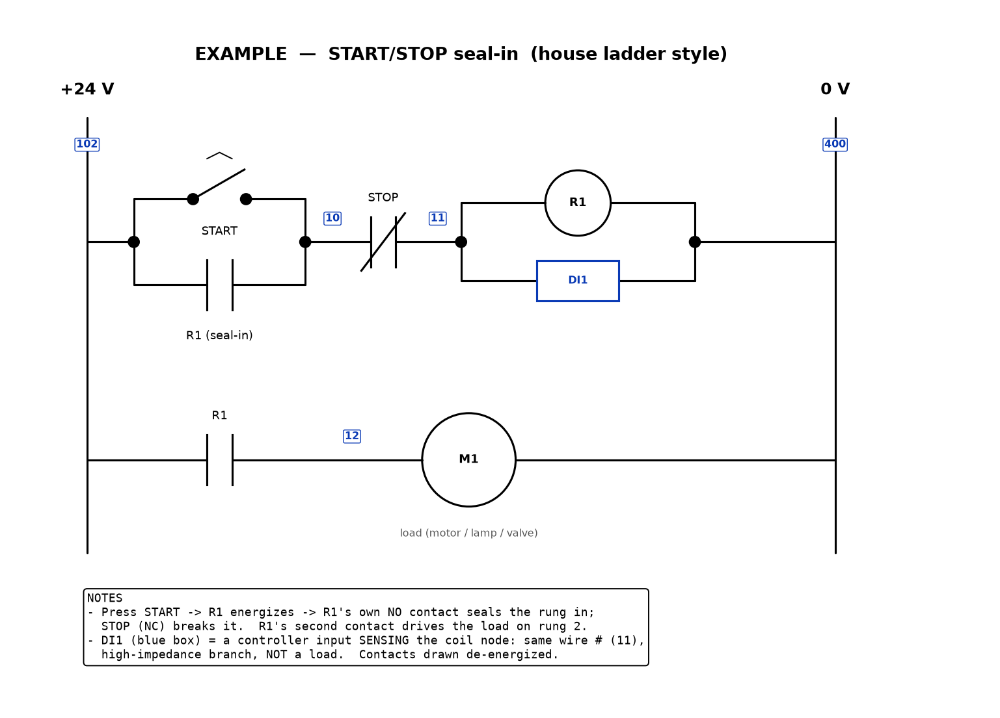

# ladder-electrical-diagrams

A [Claude Code](https://claude.com/claude-code) **skill** for drawing industrial
control-wiring drawings as **JIC/NEMA ladder diagrams with plain matplotlib** — the way
a controls person hand-sketches a rung, not the way an EDA tool lays out a PCB.

Built and battle-tested at McLeod Farms designing a 16-relay orchard-sprayer control
system: seven production sheets (power latch, operator controls, section-drive ladder,
I/O map, output stages), every one reviewed rung-by-rung by the person who wires the
panels.



## What's in it

| File | What |
|---|---|
| `SKILL.md` | The skill: workflow (rung-list first → draw → self-review → **human approval gate** → doc sync), electrical house rules, tooling gotchas. |
| `references/ladder_helpers.py` | Canonical drawing helpers: NO/NC contacts, coils, toggles (incl. momentary), controller-input boxes, rails, net tags, junction dots, notes blocks, highlight bands. Plain matplotlib, no dependencies beyond it. |
| `references/conventions.md` | Device naming, net-numbering rules (one number per node; new number only where a contact separates nodes; senses ride the coil's net), symbol table, layout rules, sheet organization. |
| `examples/example_start_stop.py` | A complete worked sheet — the classic START/STOP seal-in rung — showing most of the vocabulary. Run it, get the PNG above. |

## Install (as a Claude Code skill)

Copy this folder into your project (or your user config):

```bash
# project-scoped
git clone https://github.com/thepeachfarmer/ladder-electrical-diagrams \
  .claude/skills/ladder-electrical-diagrams

# or user-scoped (all projects)
git clone https://github.com/thepeachfarmer/ladder-electrical-diagrams \
  ~/.claude/skills/ladder-electrical-diagrams
```

Claude Code picks it up automatically; asking for "a ladder diagram of the pump
interlock" (or similar) will trigger it. It also works fine as a plain reference for
humans — the helpers file and conventions doc stand on their own.

## Try the example

```bash
python3 -m pip install matplotlib
python3 examples/example_start_stop.py   # writes examples/example_start_stop.png
```

## The opinions baked in

- **Ladder diagrams, not schematics.** For relay/switch/coil control logic. If you're
  drawing opamps and ICs, use a circuit tool (e.g. schemdraw) instead.
- **matplotlib over a diagram DSL.** Exact coordinate control, no layout-engine fights,
  and every symbol is ten lines of code you can change when your reviewer wants the
  lever drawn differently. PNG output only (SVG backends choke on text-heavy sheets).
- **The design record is the source of truth.** The drawing documents nets and devices
  that already exist on paper; it never invents them.
- **A human approves every sheet.** AI self-review catches a lot; it does not catch
  everything a panel-builder catches. The workflow treats human sign-off as the gate,
  and turns reviewer corrections into written rules so they stick.

Symbols follow the JIC standard (NMTBA spec EGP1-1967). That classic symbol chart is
third-party material and isn't redistributed here — search "JIC ladder diagram symbols"
for a copy; the helpers draw the relay-logic subset directly.

## License

MIT — see [LICENSE](LICENSE).
